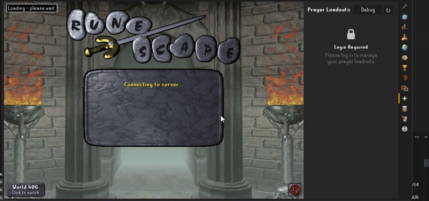

# Prayer Loadouts

A RuneLite plugin that allows you to save and load named prayer book arrangements.

## Features

- **Save loadouts** - Save your current prayer order, hidden prayers, and filter settings as a named loadout
- **Load loadouts** - Quickly restore any saved loadout with one click
- **Auto-load** - Automatically loads your last used loadout on login
- **Import/Export** - Share loadouts via clipboard between accounts or with friends

## Requirements

- The Runelite default **Prayer** plugin must be enabled for this plugin to function

## Usage

1. Open the Prayer Loadouts panel from the sidebar (Prayer skill icon)
2. Arrange your prayers using the Runelite default Prayer plugin's reorder/hide features
3. Click "Save" and enter a name for your loadout
4. Load any saved loadout by clicking the "Load" button
